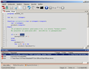
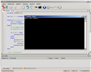
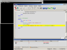
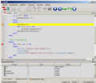
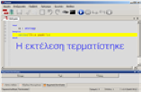
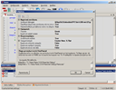

<h1>PAME</h1>

  
To PAME αποτελεί ένα ολοκληρωμένο περιβάλλον ανάπτυξης προγραμμάτων σε PASCAL απευθυνόμενο σε μαθητές. 
	
  
Χαρακτηριστικά: 
 
  <ul>
    <li>Είναι πολυγλωσσικό, περιλαμβάνοντας ελληνικό και αγγλικό user interface 
    (διεπαφή χρήστη). </li>
    <li>Επίσης εμφανίζει σωστά τα ελληνικά (ή αλλής γλώσσας) strings στα 
    εκτελέσιμα προγράμματα κονσόλας. Ώς αποτέλεσμα δεν απαιτείται πλέον από 
    τους μαθητές η χρήση greeklish στα προγράμματα.</li>
    <li>Τα μηνύματα λάθους (και γενικότερα εκτέλεσης του μεταγλωττιστή) 
    είναι και αυτά (κατ&#39; επιλογή) στα ελληνικά.</li>
    <li>Λόγω του οτι απευθυνεται σε μαθητές και αρχάριους, έχει όσο το 
    δυνατόν απλούστερο αλλά λειτουργικο interface.</li>
    <li>Περιλαμβάνει editor, compiler και <strong>debugger</strong>  δίνοντας πλέον στον μαθητή τη δυνατότητα
    <strong>βηματικής εκτέλεσης των προγραμμάτων 
    και παρακολούθησης τιμών μεταβλητών</strong>.  
    Δυνατότητα που δεν 
    υποστηριζόταν στην προηγούμενη έκδοση του PAME.</li>
    <li>Υποστηρίζει αυτόματες ενημερώσεις μεσω Internet.</li>
  </ul>
  
Τεχνικά χαρακτηριστικά:

  <ul>
    <li>Βασίζεται στον σύγχρονο και δημοφιλη μεταγλωττιστή FreePascal.</li>
    <li>Μπορει να χρησιμοποιήσει είτε τον ενσωματωμένο FreePascal compiler 
    είτε μια εξωτερική εγκατάσταση της FreePascal.</li>
    <li>Παρ&#39;οτι ο installer ειναι ένας (για πρακτικούς λόγους), το PAME, 
    ανάλογα με το που έχει εγκατασταθεί, τρέχει είτε σε 64-bit είτε σε 
    32-bit χωρις εξομοίωση.</li>
  </ul>

 

<h1>Τεχνικές Απαιτήσεις</h1>

  
Για την εγκατάσταση και σωστή λειτουργία του PAME απαιτούνται:

  <ul>
    <li><strong>Δικαιώματα διαχειριστή</strong> κατά την εγκατάσταση.</li>
    <li>Windows PC με <strong>Windows XP Service Pack 2</strong> και άνω. Windows 2000 δεν υποστηρίζονται λόγω περιορισμών του .Net framework 4.</li>
    <li><strong>.Net Framework 4.0</strong>. Αν δεν είναι ήδη εγκατεστημένο θα σας ζητηθεί 
    από την εγκατάσταση του PAME. Εναλλακτικά μπορείτε να το εγκαταστήσετε 
    και μόνοι σας από εδώ:
    <a href="http://go.microsoft.com/fwlink/?LinkID=186913">
    http://go.microsoft.com/fwlink/?LinkID=186913</a> </li>
  </ul>

 

<h1>Εικόνες</h1>

  <table cellpadding="10">
    <tbody class="auto-style3">
    <tr>
      <td align="center"> 
      Μεταγλώττιση</td>
      <td align="center"> 
      Εκτέλεση</td>
      <td align="center"> 
      Βηματική εκτέλεση</td>
      <td align="center">
      &nbsp;</td>
    </tr>
    <tr>			
      <td align="center">
   
      Βηματική εκτελεση με
       
      εμφανή στα αριστερά  
      τα
      &quot;Στοπς&quot; (Breakpoints)</td>
      <td align="center">
       
      Ανάδραση με 
      On Screen Display</td>
      <td align="center">
   
      Ρυθμίσεις 
      εφαρμογής</td>
      <td>&nbsp;</td>
    </tr>
    </tbody>
  </table>

 

<h1>Κατέβασμα και Εγκατάσταση</h1>

  
Κατεβάστε το πακέτο εγκατάστασης της τελευταίας έκδοσης του PAME απο <a href="https://github.com/samartzidis/pame/raw/master/Bin/Setup.msi">εδω</a>. 
  Στη συνέχεια εκτελέστε το και ακολουθήστε τις οδηγίες.

  
Σημειώσεις:

  <ol>
    <li>Μετά την εγκατάσταση, αν θέλετε να αλλάξετε τη γλώσσα της γραφικής διεπαφής (user interface), πηγαίνετε στο μενού
    Tools&rarr; Options και στην επιλογή <strong>Language</strong> επιλέγετε τη γλώσσα που θέλετε. Τελος, κλείνετε και ξανά-ανοίγετε τo PAME.
    </li>
    <li>Για να εμφανίζονται τα μηνύματα λάθους του μεταγλωττιστή στα Αγγλικά 
    και όχι στα Ελληνικά (που είναι και η προεπιλογή),&nbsp; πηγαίνετε στο μενού <strong>Tools&rarr; Options</strong>και στην επιλογή
    <strong>Flags μεταγλωττιστή FreePascal</strong> αλλάζετε τη γραμμή:  
    <pre>-gp -vb -Fr&quot;$(AppDir)\fpc.el.msg&quot;</pre>
    σε: 
    <pre>-gp -vb</pre></li>
  </ol>

 

<h1>Συχνές Ερωτήσεις (F.A.Q.)</h1>

    
Κατά καιρους λαμβάνω e-mails χρηστών με απορίες ή προβλήματα σχετικά με 
    το PAME. Τα πιο σημαντικά ή χρήσιμα από αυτά βρίσκονται εδώ:

    
<strong>1. Εμφάνιση ελληνικών κατά την εκτέλεση προγράμματος απο τα Windows</strong>

    
<em>Όταν εκτελώ ένα πρόγραμμα μέσω του PAME τα ελληνικά εμφανιζονται σωστα. Όταν το εκτελώ όμως εκτός του PAME, δηλαδή απευθείας από τα Windows (δηλ. με διπλο κλικ στο αρχείο), έμφανίζονται ακατανόητοι χαρακτήρες στα μηνύματα εξόδου. Πώς μπορώ να εκτελέσω .exe αρχεία που δημιουργήθηκαν από το PAME χωρίς να έχω πρόβλημα με τα ελληνικά;</em>

    
Όταν ένα πρόγραμμα εκτελείται απευθείας απο τα Windows (δηλ. με διπλό κλικ) και όχι μέσω του PAME, δεν ενεργοποιειται το ελληνικο Windows codepage (δηλ. το 1253) αλλα και η σωστη γραμματοσειρα (που πρεπει να ειναι τυπου TrueType όπως η Lucida Console, και όχι Raster), πραγμα που κανει αυτοματα το PAME πριν εκτελεσει το προγραμμα Pascal. Το αποτελεσμα είναι να εμφανίζονται ακατανόητοι χαρακτηρες εξοδου στην κονσολα (στα writeln για παραδειγμα) όταν προκειται για ελληνικα.

    
Για να εμφανιζονται σωστα τα ελληνικα στη περιπτωση που το προγραμμα εκτελειται απευθειας από τα Windows (και όχι μονο μεσω του PAME), πρεπει να γίνουν καποιες γενικες ρυθμισεις στο registry για τη κονσολα (command prompt) των Windows. Συγκεκριμενα να προσθέσετε στο κλειδι: ”<strong>HKEY_CURRENT_USER\Console</strong>” τις τιμες: 
    <pre><strong> "FaceName"="Lucida Console"</strong> και <strong>"CodePage"=dword:000004e5</strong>.</pre>

    
Μπορείτε να κατεβάσετε το αρχείο registry <a href="https://github.com/samartzidis/pame/raw/master/Bin/1253_lucida_console.zip">1253_lucida_console.zip</a> που κανει αυτοματα αυτή τη δουλεια. Σημειώστε όμως να έχετε δικαιωματα διαχειριστη κατά την εκτελεση και το user access control απενεργοποιημενο στα Windows 7 ή στα Vista.

    
Αν και λογικά δεν υπάρχει λόγος να γίνει κάτι τέτοιο, αν θέλετε μελλοντικά να διαγράψετε τις 2 αυτές τιμές που προσθέσατε στο κλειδι ”<strong>HKEY_CURRENT_USER\Console</strong>”, μπορείτε να χρησιμοποιήσετε τον Registry Editor των Windows (regedit.exe).

 

<h1>Τεχνικά Θέματα</h1>

    
Το PAME αποθηκεύει στον φάκελλο <strong>&quot;c:\users\&lt;όνομα χρήστη&gt;\&quot;</strong> 
    (στα 7 και Vista) ή στον <strong>&quot;c:\Documents and Settings\&lt;όνομα χρήστη&gt;\</strong>&quot; 
    στα XP το αρχείο <strong>Pame.log</strong> που περιέχει το τεχνικό log της 
    εφαρμογης για το συγκεκριμένο χρήστη. Το αρχέιο αυτό μεγαλώνει το πολύ μέχρι 
    4MB και μετά ανακυκλώνεται. Σε περίπτωση που θέλετε να στείλετε μήνυμα με 
    κάποιο πρόβλημα που εντοπίσατε κατά τη χρήση της εφαρμογής, θα βοηθούσε να 
    στέλνατε και αυτό το αρχείο (δεν χρειάζεται όλο, οι τελευταίες 100 γραμμές 
    είναι αρκετές).

 

<h1>Η Υλοποίηση</h1>

    
Το PAME είναι υβριδικό, γραμμμένο σε C# με λιγα 
    κομμάτια κωδικα σε C++, κυρίως για χαμηλου επιπέδου process και console 
    management. 

    
    
Ένα σημαντικό πρόβλημα στην ανάπτυξη του debugger για το PAME, ηταν με 
    ποιόν τρόπο θα επικοινωνεί το GUI με τον
    <a href="http://www.gnu.org/software/gdb/">GDB</a> debugger, που είναι και ο 
    μονος debugger ο οποίος συνεργάζεται καλά με την FreePascal. O GDB δεν προσφέρει καποιο API/βιβλιοθήκη (για χρήση απο άλλα 
    προγράμματα), παρα μονο το command-line interface για χρήση από άνθρωπο μέσω 
    κονσόλας. Επισης, ο GDB στοχεύει σε POSIX περιβάλλον και δεν γίνεται compile 
    απευθείας με compilers της Microsoft, ενώ ο κώδικας του είναι αρκετά 
    περιπλεγμένος για να μπορέσει να αναλυθεί σε τέτοιο επίπεδο ούτως ώστε να 
    δημιουργηθεί αυτό το API (που δεν υπάρχει) από κάποιον τρίτο. Η λύση φαινόταν να είναι μονο το command-line interface του GDB. Ομώς η 
    επικοινωνία μεταξύ εφαρμογών σε τέτοιο επίπεδο (text-mode) είναι απιστευτα 
    περίπλοκη και error-prone. Για να εξασφαλιστεί η αξιοπιστία της υλοποίησης, 
    η λύση ήταν ή ανάλυση του&nbsp;
    <a href="http://ftp.gnu.org/old-gnu/Manuals/gdb-5.1.1/html_node/gdb_211.html">
    GDB/MI</a> command-line interface του GDB σε γραμματική BNF ή οποία σε 
    συνδυασμο με έναν recogniser φτιαγμένο από parser generator θα έδινε μια 
    αξίοπιστη βάση για την ανάπτυξη του API. O parser generator που 
    χρησιμοποιήθηκε ήταν ο <a href="http://www.antlr.org/">ANTRL</a> ο οπόιος 
    και έδωσε τους recognisers για το GDB/MI. Πάνω σε αυτούς χτίστηκε ένα robust 
    API για το GDB.

    

 

PAME is powered by:

	
